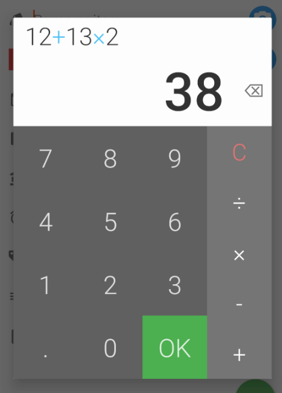

# KotlinCalculator
Calculator library built on Kotlin, compatible with Java projects. Pure Kotlin module, lightweight, very flexible.  
[](https://jitpack.io/#jairrab/KotlinCalculator)
## Gradle Setup
```
repositories {
    maven { url 'https://jitpack.io' }
}

dependencies {
    implementation 'com.github.jairrab:KotlinCalculator:2.1.0'
}
```
## Usage
To get an instance of the `Calculator` library, call `Calculator.getInstance()` and pass a listener to receive calculator updates.
```kotlin
class MainActivity : AppCompatActivity(), Calculator.Listener {
    override fun onCreate(savedInstanceState: Bundle?) {
        super.onCreate(savedInstanceState)
        setContentView(R.layout.activity_main)

        val calculator = Calculator.getInstance(this)
    }

    override fun onCalculatorUpdate(key: String?, entries: List<String>, result: Double) {
        Log.v("CALC", "key: $key | entries: $entries | result: $result")
    }
}
```
Additionally, you can provide additional parameters to get your `Calculator` instance. By default, the calculator returns an MDAS calculator, that is, it performs multiplication and division before addition and subtraction. It is similar to the following more explicit call:
```kotlin
Calculator.getInstance(CalculatorType.BASIC_MDAS, 0.0, this)
```
To use a non-MDAS calculator, pass a `CalculatorType.BASIC_NON_MDAS` parameter:
```kotlin
Calculator.getInstance(CalculatorType.BASIC_NON_MDAS, initialNumber, this)
```
The `initialNumber` parameter returns an instance of the calculator with the starting set to this number. This can be used when you want to launch your calculator with a starting number, such as in the case where you would like to edit an existing number.

`Calculator.getInstance()` returns a `Calculator` interface that provides the following functions:
```kotlin
calculator.clear()
calculator.pressOne()
calculator.pressTwo()
calculator.pressThree()
calculator.pressFour()
calculator.pressFive()
calculator.pressSix()
calculator.pressSeven()
calculator.pressEight()
calculator.pressNine()
calculator.pressZero()
calculator.pressDecimal()
calculator.pressPlus()
calculator.pressMinus()
calculator.pressMultiply()
calculator.pressDivide()
calculator.backSpace()
calculator.pressEquals()
```
You can also use the universal `press()` function:
```
calculator.press(CalculatorButton.ONE)
calculator.press(CalculatorButton.TWO)
//etc
```
`Calculator.Listener` receives updates when a calculator function is called. Here's an example of a sequence of calculator operations with it's resulting logs:
```kotlin
val calculator = Calculator.getInstance(CalculatorType.BASIC_MDAS, 0.0, this)
calculator.pressOne()
calculator.pressTwo()
calculator.pressThree()
calculator.backSpace()
calculator.pressPlus()
calculator.pressOne()
calculator.pressThree()
calculator.pressMultiply()
calculator.pressTwo()
calculator.pressEquals()
```
```
I/CalculatorLog: Key: initializing | Entries: [] | Result: 0.0
I/CalculatorLog: Key: 1 | Entries: [1] | Result: 1.0
I/CalculatorLog: Key: 2 | Entries: [12] | Result: 12.0
I/CalculatorLog: Key: 3 | Entries: [123] | Result: 123.0
I/CalculatorLog: Key: backspace | Entries: [12] | Result: 12.0
I/CalculatorLog: Key: + | Entries: [12, +] | Result: 12.0
I/CalculatorLog: Key: 1 | Entries: [12, +, 1] | Result: 13.0
I/CalculatorLog: Key: 3 | Entries: [12, +, 13] | Result: 25.0
I/CalculatorLog: Key: * | Entries: [12, +, 13, *] | Result: 25.0
I/CalculatorLog: Key: 2 | Entries: [12, +, 13, *, 2] | Result: 38.0
I/CalculatorLog: Key: 2 | Entries: [12, +, 13, *, 2, =] | Result: 38.0
```
The calculator is a pure Kotlin module library and does not have any Android dependency, thus you will need to provide a UI to call the and display the calculator functions. This makes the library lightweight and very flexible to suit your needs. Here's what a typical UI may look like displaying the above operations:
### UI Sample

